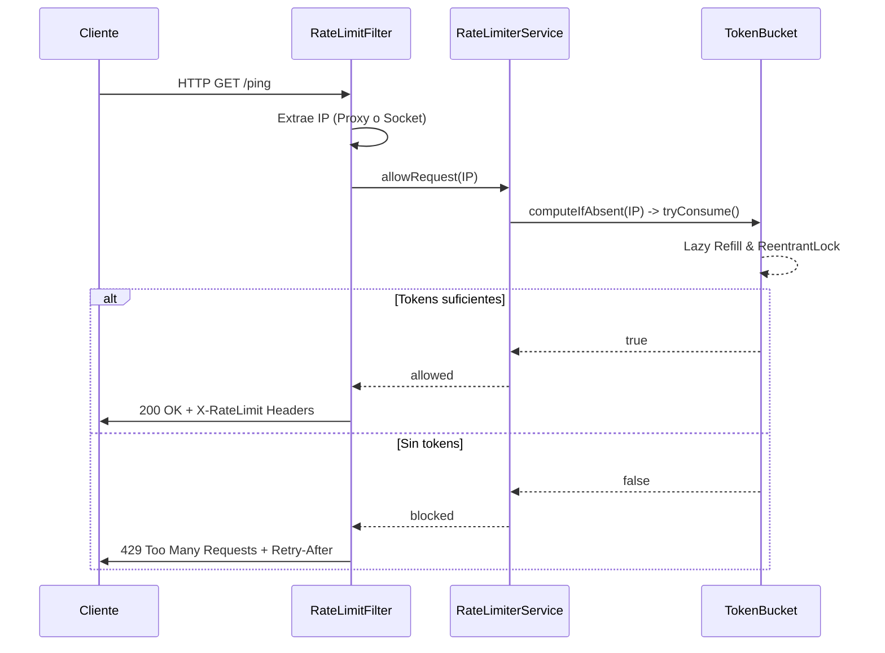

# Java Rate Limiter

Un middleware de Rate Limiting ultraligero construido en Java puro (sin frameworks web), diseñado para interceptar peticiones HTTP y proteger APIs frente a ráfagas de tráfico y abusos.

Desarrollado como un reto de fin de semana, este proyecto implementa el algoritmo **Token Bucket** con evaluación perezosa (*lazy evaluation*), evitando el consumo innecesario de hilos en segundo plano por cliente y manteniendo el enfoque puramente en la arquitectura de sistemas.

## Características Principales
- **Algoritmo de Token Bucket:** Elegido porque permite rafagas (*bursts*) controladas manteniendo una tasa de procesamiento estable.
- **Evaluación Perezosa:** Cálculo de recarga de tokens en el momento exacto de la petición, optimizando la CPU.
- **Thread-Safe:** Uso de `ReentrantLock` y `ConcurrentHashMap` para garantizar precisión bajo alta concurrencia.
- **Prevención de Memory Leaks:** Incluye un *Janitor Worker* que limpia periódicamente las IPs inactivas.
- **Soporte para Proxies:** Extrae correctamente la IP del cliente real leyendo encabezados como `X-Forwarded-For` y `CF-Connecting-IP`.
- **Cero Dependencias Core:** El servidor HTTP y la lógica utilizan exclusivamente bibliotecas nativas de Java (`com.sun.net.httpserver`). (Solo se utiliza JUnit 5 para tests).

## Arquitectura

El sistema actúa como un Middleware antes de que la petición alcance los endpoints de la aplicación.



## Cómo Empezar

### Prerrequisitos

- Java 17 o superior.
- Maven (opcional, dependiendo de cómo decidas compilar).

### Ejecución

1. Clona este repositorio:

   ```bash
   git clone https://github.com/CamilaTorres1035/rate-limiter.git
   cd rate-limiter
   ```

2. Compila y ejecuta el servidor nativo:

    ```bash
   ./mvnw clean compile exec:java -Dexec.mainClass="com.camss.server.SimpleHttpServer"
   ```

El servidor arrancará en [http://localhost:8080](http://localhost:8080)

## Pruebas y Benchmarking

### Pruebas Unitarias

El proyecto cuenta con una suite completa en JUnit 5 que simula el paso del tiempo y concurrencia sin hilos durmientes (Thread.sleep).

```bash
   ./mvnw test
   ```

### Pruebas de Carga

Puedes validar la robustez y el rate limiting bajo estrés utilizando el script de k6 incluido:

```bash
   k6 run load-test.js
   ```

## Aprendizajes del Proyecto

La construcción de este sistema desde cero refuerza conceptos clave de ingeniería de software y backend:

- **Algoritmos de Limitación:** Existen diversas estrategias (Leaky Bucket, Fixed Window, Sliding Window), cada una con ventajas y desventajas. Token Bucket destaca por permitir flexibilidad ante ráfagas sin penalizar el rendimiento global.
- **Gestión de Concurrencia:** Es vital comprender y prevenir las Race Conditions. El uso de ReentrantLock permite bloquear momentáneamente el estado interno de la cubeta de forma segura. Asimismo, ConcurrentHashMap es indispensable para aislar a los clientes, ya que un HashMap estándar no es Thread-Safe y su estado puede corromperse bajo peticiones simultáneas.
- **Extracción de Identidades en Red:** La IP de una petición suele estar enmascarada. Es obligatorio extraerla considerando la infraestructura subyacente (CDNs y Proxies), priorizando la lectura de encabezados estándar.
- **Evicción de Memoria:** Un diseño in-memory sin una estrategia de limpieza se convierte rápidamente en un Memory Leak. La implementación de mecanismos activos de evicción (Janitor) garantiza la estabilidad del sistema a largo plazo.

> Construido como proyecto de fin de semana para explorar sistemas de backend y concurrencia sin frameworks pesados.

---

<div align="center">

**Camila Torres**

[](https://github.com/CamilaTorres1035)

</div>
